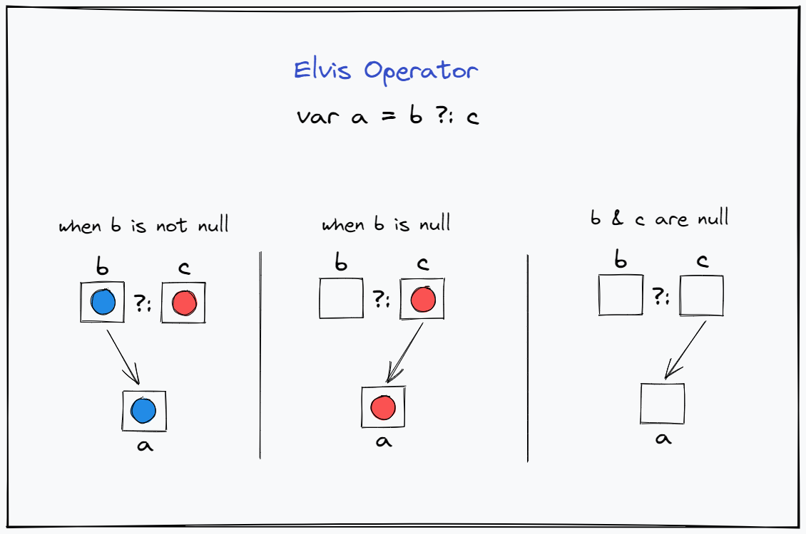

# Elvis operator

null was an issue in Java

kotlin makes it easier to see which objects can be null and which aren't

```kotlin
var name: String = "abc" // this is non null
name = null // this will not work since String type does not accept null
```

```kotlin
var name: String? = "abc" // this is non null
name = null // this will work since String? type accepts null
```

and kotlin also provides options to work with things that could be null


So the Elvis operator is defined in wikipedia as,

> In certain computer programming languages, the Elvis operator ?: is a binary operator that returns its first operand if that operand is true, and otherwise evaluates and returns its second operand. It is a variant of the ternary conditional operator, ? :, found in those languages \(and many others\): the Elvis operator is the ternary operator with its second operand omitted.

## Syntax

Here is the rough syntax for the operator,

```kotlin
variable ?: "any value or expression if variable is null"
```

So what this is saying is that Kotlin will first check if the variable is not null. If so then that same variable is the result of that expression. But if it is null, then the second part \(in this example a string\) is what is the result of that expression.



```kotlin
//     when b is non null
       var b: String = "Kenny"
       var c: String = "Proful"
       var a = b ?: c
       println(a)
    
//     when b is null
       var b: String? = null
       var c: String = "Proful"
       var a = b ?: c
       println(a)
    
//     when b and c are null
       var b: String? = null
       var c: String? = null
       var a = b ?: c
       println(a)
    
//     example with if condition
       var b: String = "Kenny"
       var c: String = "Proful"
       var a = if (b != null) b else c
       println(a)
```

### Examples

So let us see the three cases in action



```kotlin
var name: String = "Kenny"
var result = name ?: "Kotlin"
println(result)

// result has value "Kenny"
```



```kotlin
var name: String = "Kenny"
var result = name ?: "Kotlin"
println(result)

// result has value "Kenny"
```



So what happens is that this takes 

```kotlin
fun main() {

    // non null example
    var name1: String = "Kenny"
    var result1 = name1 ?: "Kotlin"
    println(result1)
    
    // null example
    var name2: String? = null
    var result2 = name2 ?: "Kotlin"
    println(result2)
    
    // same example written with if condition
    var result3 = if (name2 != null) name2 else "Kotlin"
    println(result3)
    
}
```

In this code snippet we have two examples, first the non null example. The string `name1` is initialized to a value `Kenny`. Then we use the Elvis operator and it will check

### Why Elvis?

This operator when rotated looks like the famous singer Elvis Presley's hairstyle.


### References






