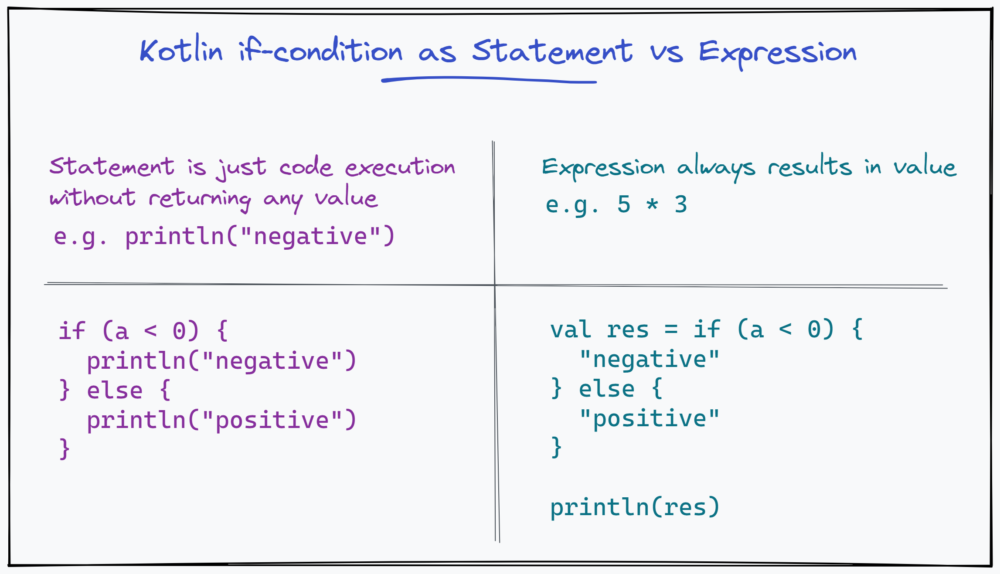

# Statement vs Expression

Expressions and statements are the basic building block of programs. They help us perform computations and also control the program flow.

Here is the difference in a generic sense, REFINE THE BELOW SECTION

Statement

val a = 5

println\("hello world"\)

Expression

5 \* 3

Statement and Expression

val a = 5 \* 3



Write the above as code into kotlin online repl.

Other things that are expressions,

```kotlin
val bigger = if(a > b) a else b

val color = when {
    relax -> GREEN
    studyTime -> YELLOW
    else -> BLUE
}

val object = try {
    gson.fromJson(json)
} catch (e: Throwable) {
    null
}
```

Because of this there is no ternary operator, since the if is an expression and returns a value.

## References








